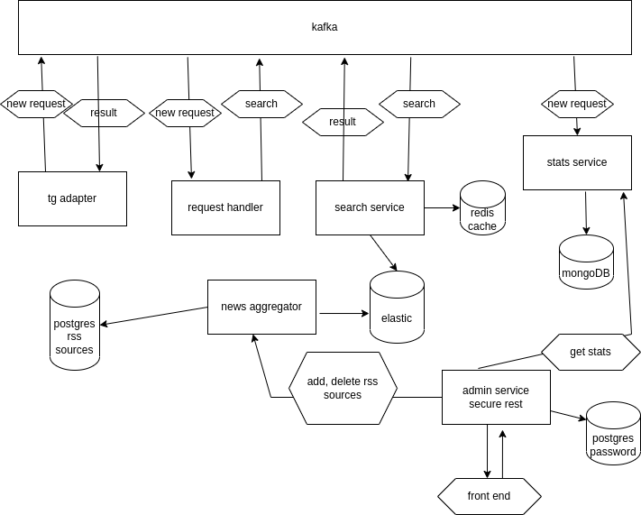

## TG news template
  

### Цель работы приложения
полнотекстовый поиск новостей за определенный период по ключемым словам которые передает пользователь.      

### Описание работы приложения
TG receiver получает запрос от пользователя и публикует его в кафку.  
stats server сохраняет его в базу.  
request handler валидирует и приводит запрос к нужному виду и публикует в кафку.  
search service ищет по запросу новости сначала у себя в кэше, если не находит то идет искать в elastic.  
ответ публикует в кафку.  
TG receiver получает этот ответ из кафки и отдает пользователю.  

#### news aggregator
с периодичностью, заданной в пропертях он скачивает новости из rss источников и складывает в эластик.  
постараться складывать только те что не были ранее добавлены.  
так же имеет рест контроллер для управления rss источниками(добавление, удаление, ?редактирование?)    
рест доступен только админу.   
для парсинга новостей из rss источников лучше использовать [ROME](https://rometools.github.io/rome/)

#### stats service
собирает статистику запросов пользователей.  
должен уметь отдавать по ресту:
 - популярные запросы за сегодня/все время
 - количество обращений за сегодня/все время
 - \* количество новых пользователей по дням

#### admin service
имеет фронт веб приложение.  
позволяет залогинится и получить jwt токен.   
с этим токеном можно смотреть статистику и управлять rss источниками.  
единственный из микросервисов к которому можно получить доступ извне.

#### Прочее
Рест взаимодействие с внешним миром должно идти через spring gateway.
Микросервисы участвующие в рест взаимодействиях должны работать через discovery service    

Каждое спринг приложение должно хранится в собранном виде на DockerHub   
репозиторий **TG receiver** должен иметь docker-compose файл который позволяет запустить приложение целиком.  
образы спринг приложений берутся из DockerHub.  
все репозитории должны иметь github actions в которых 
- на каждый пулл реквест запускается `mvn verify -P ci` или `gradle check test`
- на каждый мерж в `main` запускается сборка докер образа и он пушится на DockerHub
